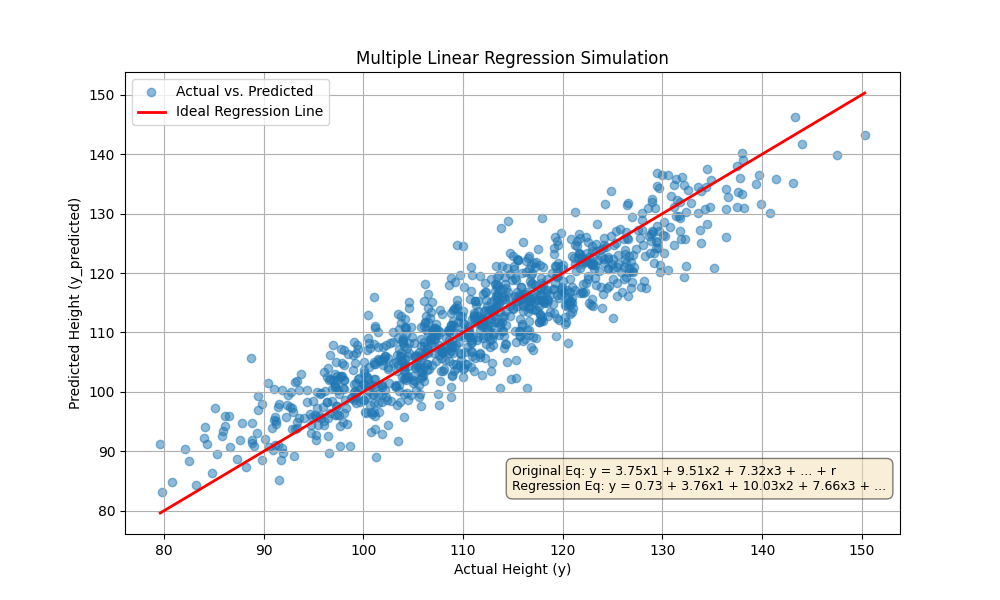

# Results: simulation6

## Generated plot

## Inputs

- num_samples: 1000
- num_features: 50
- true_coefficients (first 5): 3.7454, 9.5071, 7.3199, 5.9866, 1.5602
- noise distribution: normal(0,1) scaled by 5

## Equations

- Original (excerpt): Original Eq: y = 3.75x1 + 9.51x2 + 7.32x3 + ... + r
- Regression (excerpt): Regression Eq: y = 0.73 + 3.76x1 + 10.03x2 + 7.66x3 + ...

## Estimated coefficients (first 5)

- 0.7283, 3.7609, 10.0258, 7.6600, 5.6267

## Metrics

- R²: 0.8305
